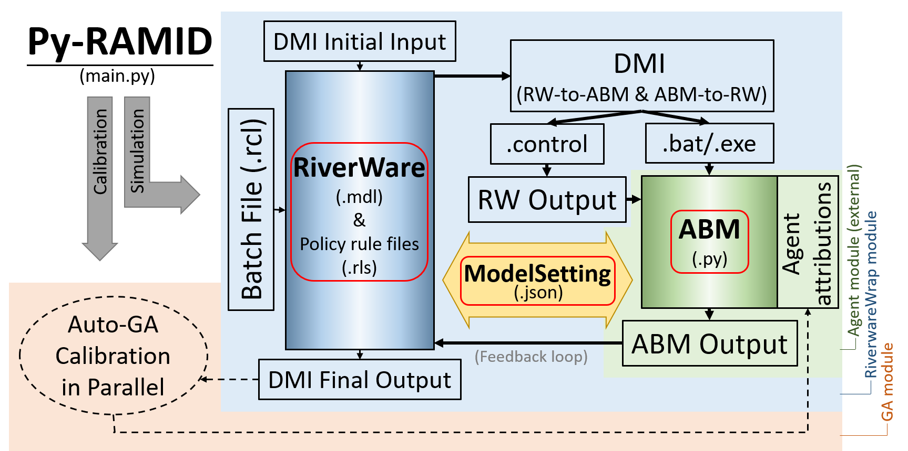

.. Py-RAMID documentation master file, created by
   sphinx-quickstart on Sat Jul  3 16:45:55 2021.
   You can adapt this file completely to your liking, but it should at least
   contain the root `toctree` directive.

Py-RAMID User Manual
====================================
A Python package of a Riverware and Agent-based Modeling Interface for Developers.

Py-RAMID is a Python package of Riverware (RW, a river-reservoir routing model) and Agent-based Modeling (ABM, a human decision model) Interface for Developers, Py-RAMID, to address co-evolution challenges in a coupled natural-human system.

Py-RAMID is designed to work under Windows operating system.

.. toctree::
   :maxdepth: 2
   
   installation

   simulation
   
   calibration

..
 Indices and tables
 ==================

..
 * :ref:`genindex`
 * :ref:`modindex`
 * :ref:`search`
