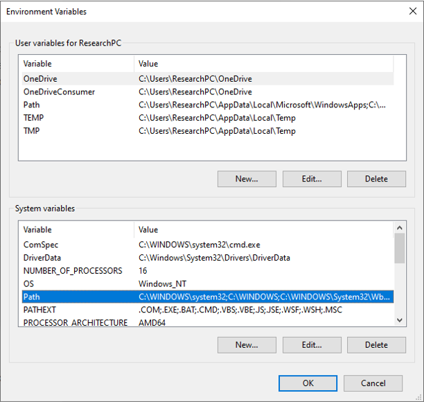

Installation
=================
Users will need to complete three things to finish the installation.

1.  Install a licensed RiverWare. Detailed instrustions of RiverWare can be found `here <https://www.riverware.org/>`_.
2.  Install Py-RAMID package_.
3.  Setup Windows environment_.

.. _package:

Install Py-RAMID
-----------------

To install Py-RAMID, users need to first clone or download the package from the `Py-RAMID GitHub respository <https://github.com/philip928lin/Py-RAMID>`_. Then, unzip the downloaded file and move to the directory containing setup.py in the terminal or the conda prompt. Next, you can install the package by the following command.

.. code-block:: python

   pip install .

.. _environment:

Windows environment setup
-------------------------
As Py-RAMID will exercute .py file through terminal commands, users need to make sure the .py file can be executed through CMD with correct environment (e.g., the virtual environment that has Py-RAMID installed). In other words, we want CMD to execute .py files with assign environment path, which contains Py-RAMID package.

To setup the environment path, please follow the steps below.

1.  Open anaconda prompt or CMD.

2.  Enter **"where python"**. Then, a list of corresponding python.exe path will appear.

3.  Copy the one that is in your working environment (e.g., the virtual environment that has Py-RAMID installed). In our example, our working environment is at **C:/Users/ResearchPC/anaconda3/envs/PyRAMID**. Note that only copy the path without **/python.exe**

4.  Open windows search and search **Edit the System Environment Variables**.

5.  Click on **Environment Variables**. Then, double click on the **Path** in the **System variables** box.

6.  Add the copied python path into popped out window, **Edit enviroment variable**.

.. image:: images/EP4.png

7. Done!

